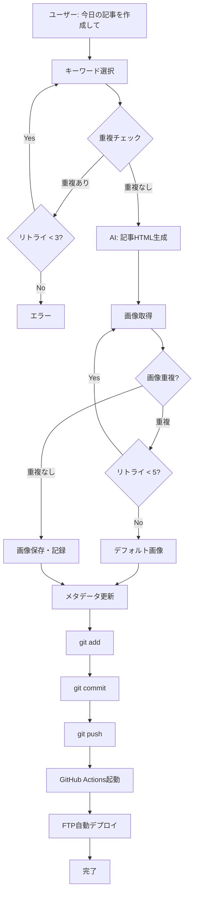

# ブログ記事生成ワークフロー（完全版）

## 概要

「今日の記事を作成して」という指示だけで、記事作成からデプロイまで完全自動化されたワークフローです。

## 実装済み機能

### 1. キーワード選択（重複チェック付き）

```bash
python3 scripts/create_today_article.py
```

- ✅ 配分比率に基づいた自動選択（A25%, B25%, C20%, D15%, E15%）
- ✅ 既存記事とのキーワード重複チェック
- ✅ テーマの類似性チェック（60%以上の共通単語を検出）
- ✅ 自動リトライ機能（最大3回）

### 2. 記事HTML生成

AIアシスタントが以下のルールに従って生成：

- 文字数: 2500-3500字
- h2見出し: 3-5個
- 内部リンク: `/#service`, `/#pricing`, `/#contact`
- ミアキス代表の経験談・地域文脈を含む
- 具体的な数字や独自見解を含む

### 3. 画像取得（重複チェック付き）

```bash
python3 scripts/fetch_blog_images.py <slug> "<title>" "<description>"
```

**重複回避機能**:
- ✅ URLハッシュ（SHA256）で既使用画像を検出
- ✅ ファイル名での二重チェック
- ✅ 自動リトライ機能（最大5回）
- ✅ `used_images.json`に自動記録

**3段階フォールバック**:
1. Unsplash API（高品質プロ画像）
2. Pexels API（代替ソース）
3. Lorem Picsum（認証不要フォールバック）

### 4. メタデータ更新

- ✅ `published_articles.json`に記事情報を追加
- ✅ `sitemap.xml`を自動更新

### 5. 自動デプロイ

```bash
python3 scripts/deploy_article.py <slug> "<commit_message>"
```

**デプロイフロー**:
1. 記事関連ファイルを`git add`
2. `git commit`
3. `git push origin master`
4. GitHub Actions起動
5. FTP自動デプロイ（1-2分で完了）

## ワークフロー全体図



## 使用例

### 完全自動化された記事作成

```bash
# 1. キーワード選択
python3 scripts/create_today_article.py
# → キーワードID 56: Googleアナリティクス 見方 が選択される

# 2. 記事生成（AIアシスタントに指示）
# → blog/2025-12-17-analytics.html が生成される

# 3. 画像取得（自動実行）
python3 scripts/fetch_blog_images.py "2025-12-17-analytics" \
  "Googleアナリティクスの基本的な見方と活用法" \
  "Googleアナリティクス、導入したけど見方がわからない..."
# → 重複チェック済み画像を自動取得・記録

# 4. デプロイ（自動実行）
python3 scripts/deploy_article.py "2025-12-17-analytics" \
  "Add new blog article: Googleアナリティクス"
# → GitHub経由で本番サイトに自動デプロイ
```

### ワンコマンドでの実行（今後の改善）

将来的には以下のコマンド1つで完結：

```bash
python3 scripts/create_and_deploy_article.py
```

## ファイル構成

### 新規作成ファイル

- `blog/used_images.json` - 使用済み画像の管理
- `scripts/deploy_article.py` - デプロイ自動化スクリプト
- `BLOG_WORKFLOW_COMPLETE.md` - このドキュメント

### 更新ファイル

- `scripts/create_today_article.py` - 重複チェック機能追加
- `scripts/fetch_blog_images.py` - 画像重複チェック・記録機能追加

## 重複回避の仕組み

### キーワード・テーマ重複チェック

```python
def check_keyword_theme_duplicate(keyword, articles):
    # 1. キーワードの完全一致チェック
    # 2. テーマの類似性チェック（主要単語の重複率）
    # 3. 60%以上類似している場合は重複と判定
```

### 画像重複チェック

```python
def is_image_used(url, filename):
    # 1. URLのSHA256ハッシュを計算
    # 2. used_images.jsonから既存ハッシュを取得
    # 3. ハッシュまたはファイル名が一致する場合は使用済み
```

## トラブルシューティング

### 画像が取得できない場合

1. `.env`ファイルにAPIキーが設定されているか確認
2. Unsplash/Pexels APIの利用制限に達していないか確認
3. Lorem Picsumフォールバックが動作しているか確認

### デプロイが失敗する場合

1. Git認証情報が正しく設定されているか確認
2. GitHub Actionsのワークフローが有効になっているか確認
3. FTP接続情報（secrets）が正しく設定されているか確認

### 重複が検出されすぎる場合

1. `used_images.json`の内容を確認
2. 必要に応じてused_images.jsonから古いエントリを削除
3. キーワード選択のリトライ回数を増やす（create_today_article.py）

## パフォーマンス

- キーワード選択: 1秒以内
- 記事生成: 30-60秒（AI処理時間）
- 画像取得: 5-10秒（API呼び出し × 2）
- デプロイ: 1-2分（GitHub Actions + FTP）

**合計**: 約2-4分で記事が本番サイトに公開されます

## 今後の改善予定

1. ワンコマンド実行スクリプトの作成
2. 記事生成のさらなる自動化
3. 画像選択のAI最適化
4. デプロイ通知機能（Slack/Discord連携）
5. 記事プレビュー機能

## メンテナンス

### 月次

- `used_images.json`のサイズ確認（1000件を超えたら古いエントリを削除検討）
- APIキーの利用状況確認

### 年次

- キーワードリスト（`keywords.json`）の見直し・追加
- カテゴリ配分比率の調整

---

**最終更新**: 2025-12-17  
**バージョン**: 2.0（重複チェック機能実装済み）


